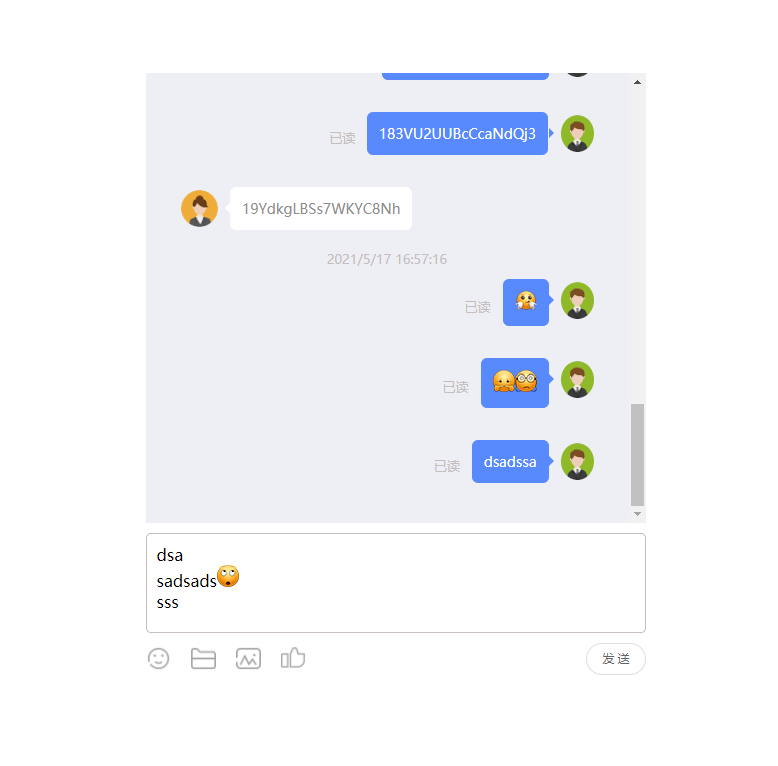
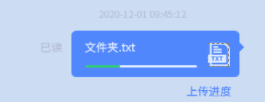
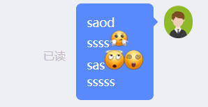

# chatWindowDemo

> 描述：这是一个聊天窗的dome
>
> 基本上是纯原生的，但是因为是原本在项目中写的，所以稍微借用了一下 elementUI的文件上传功能
>
> 主要大区域包括：聊天窗口，消息编辑框，
>
> 主要功能包括：消息，表情，实时监听 截图粘贴/图片粘贴 上传服务器，回显图片地址，发送文件（显示进度条），支持ctrl+enter换行，enter发送等功能

### 示例：



### 文件上传：



## 聊天窗口

> 1. 消息的展示
>
> 2. 不同类型消息的处理（图片，表情，文字，文件）
>
> 3. 自己发送消息时 窗口不管在什么地方都会直接滚至底部
>
> 4. 窗口在底部时，发送消息和接受消息，窗口都会滚至底部
> 5. 窗口不在底部时，接收到消息  会提示接收"您有n条未读消息"
> 6. 窗口不在底部时，点击你有几条新消息气泡立即返回底部

主要功能是将消息进行展示

每一个消息体的对象是这样的

```javascript
{
   // 消息体的身份  
   // 当其等于 this.userType 就代表这条消息是自己发的 在右边
   usertype:userType, 
   content, // 消息内容
   avatar:"", // 头像默认为空
   isread:true,
   createtime:new Date()
}
```

每一个content是这样的

```
* 图片 [image/img](url)
* 表情 [image/emoji](url)
* 文件 [file/{fileName}\*\{fileSize}](url)
```

### 示例：

```
处理之前的内容是这样的（这是输入框处理的结果）：
"saod<div>ssss[image/emoji](/static/images/emoji/15hgg.png)<div>sas[image/emoji](/static/images/emoji/30xy.png)[image/emoji](/static/images/emoji/33ty.png)<div>sssss</div></div></div>"

处理之后进行回显的HTML是这样的：
"saod
<div>ssss
    
    <div>sas
        
        
        <div>sssss</div>
    </div>
</div>"

```

## 输入框

> 1. 支持ctrl+回车换行 支持回车发送消息
>
> 2. 支持表情
>
> 3. 支持微信或者其他的截图直接粘贴
>
> 4. 支持图片文件上传
>
> 5. 支持从其他网站直接拷贝图片链接进行粘贴

> 特点1：将截图直接粘贴过来因为是base64码，防止对数据库造成太大压力，所以这里我是监听粘贴的事件，当触发粘贴时，判断剪切板中是不是图片，如果是，就进行上传到服务器，服务器返回的地址作为回显地址进行显示，所以没有服务器是显示不出来的
>
> 特点2：防止有人快速的 ctrl+v vvvvvvvvvv....，对上传造成异常处理，这里我用了职责链设计模式，改造了一下函数链，以达到，上一个图片上传完毕，下一个才可以上传，所有图片没有上传完毕，不能点击发送按钮，防止base64，存入数据库

### js的工具库

> 函数链的实现
>
> 防抖的工厂
>
> 节流的工厂
>
> 一些常用的工具
>
> 是的  都是我自己写的，有心人可以参考一下嘿嘿

作者简介：坐标西安，对待工作对待生活都很细心，虽然公司是小公司，但是在合适的地方还是喜欢自己造轮子，写通用方法，希望有大佬和我做朋友 可以一起交流

## 如果觉得好的话  可以多多分享 谢谢

WeChat：xie90237（注明来意）

微信公众号：风岚前端（好久没有更新了，目前都是一些设计模式）